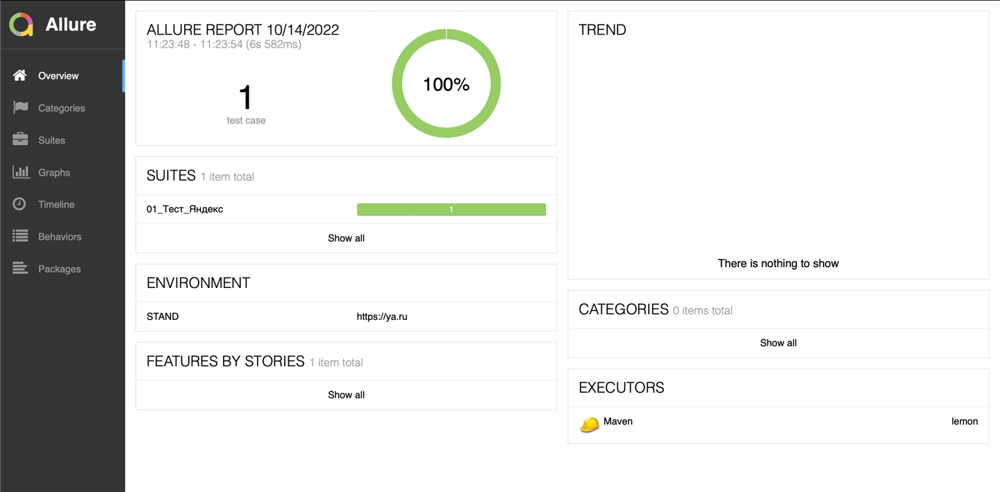

# Project Lemon

Данный проект является стартером для работы по автоматизации front-end. 
***Project-Lemon*** создан для того, чтобы не разрабатывать похожие вещи, а взять уже имеющуюся архитектуру и на этой основе выстраивать автоматизацию на любых проектах.

## Основное

1. Настроенный pom.xml
2. Настроен Allure
3. Используется логирование прохождение тестов, которое в свою очередь выявляет ошибки из вкладки Network консоли разработчика,а после в allure отчете описывает ошибки.

4. Добавленны основные методы по работе с драйвером в пакете **util**, а так же обработки ошибок.

## Стек технологий

- Java 17    	 
- Selenium  		 
- Junit 5   
- Maven
- Allure report  
- Xpath  
- Rest Assured

## Структура фреймворка
 - **constant** - в константы и ряд других неизменяемых типов данных;
 - **page** - страницы локатаров;
 - **step** - указаны используемые в работе методы  для воспроизведении шагов;
 - **tc** - кластер методов/шагов оборачиваемых в тесткейс;
 - **util** - основные классы по работе с selenium, базами данных, ряд других служебных классов;
 - **network** - логирование ошибок в консоли(Зашит при запуске и окончании тестов).

## Property 
 В проекте 3 проперти файла. 
  - **dev.properties** - данные для тестового контура;
  - **stage.properties** - данные для контура предпрод;
  - **prod.properties** - данные для контура прода.

## Локальный запуск тестов
Запуск через Junit:
В строке запуска передается команда -ea -Denv=prod(dev/stage),
где значение после "=" - название конфиг файла.

## Локальный запуск Allure report после прогона тестов
- mvn allure:serve

- Если произошла ошибка, в отчете будет отображаться скрин в момент падаенияя.

